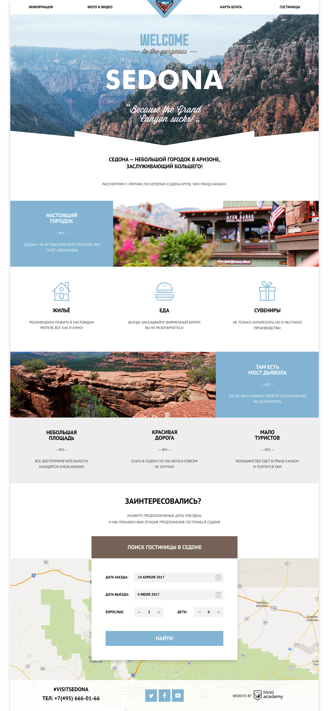
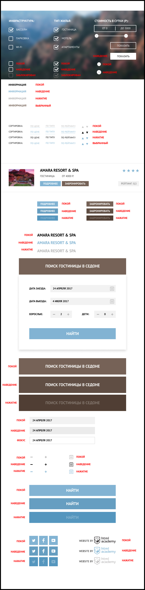

# Student: [Pavel Ivanov](https://https://vk.com/artist_idiot).

---

# Sedona
Sedona is an entry-level @htmlacademy layout.

---

# Site pages

## `Index`

## `Catalog`

## `Styleguide`

---

## Technical task

## 1. General technical requirements

* 1.1. Layout standards: HTML, CSS, progressive enhancement.
* 1.2. Grid: defined in the layout.
* 1.3. Layout adaptability: no.
* 1.4. Frameworks used: none.
* 1.5. Cross-browser compatibility: Chrome, Firefox, Safari.
* 1.6. Typography: partly defined in the layout, others are at the discretion of the developer.
* 1.7. Font used: PT Sans. The font is in the project folder and on Google Fonts.
* 1.8. A style guide is provided with the layout, which contains drawing the states of the interface elements. For any discrepancies with layouts, it should take the highest priority.

---

## 2. Explanations for students

* 2.1. The section "Prerequisites" describes the behavior of blocks that must be implemented to successfully protect the project. Requirements from the Additional Requirements section can be implemented as desired to fulfill additional criteria.

---

## 3. Mandatory requirements

### All layouts

* 3.1. The content area is centered and cannot be narrower than the layout width.
* 3.2. The logo is not a menu item. It needs to be marked up as a separate element.
* 3.3. Main menu: the "Information" item is not a link to the main page.
* 3.4. Main menu: four cells of the same width. For the first two items, alignment of the text to the left, for the last two - to the right.
* 3.5. Links in the main menu: only text should be clickable.
* 3.6. There should be a gray background to the left and right of the content area, on which the site casts a light shadow.
* 3.7. In the three blocks of the footer, the content is centered.
* 3.8. The Academy logo in the basement leads to the intensive landing page “HTML and CSS. Professional site layout ".

### Index

* 3.9. Large photo: The photo spans the entire width, with a white mask at the bottom.
* 3.10. By default, the hotel search form should be open.
* 3.11. The button "Find a hotel in Sedona" controls the display of the hotel search form. Layout of the block with the hotel search form is required.
* 3.12. The calendar icon in the date input field should be added as a separate element so that in the future the programmer can hang a click event on it to open a calendar with a date selection option.
* 3.13. Map Block: Sufficient Implementation - Regular Image.

### Catalog

* 3.14. The logo is a link to the home page.
* 3.15. The main menu and footer are the same as the main page.
* 3.16. Large photo: The photo takes up the entire width, but differs from the main page - it is blurry and smaller in height.
* 3.17. Filter: typeset using the form, the "Show" button is responsible for sending the form to the address https://echo.htmlacademy.ru/.
* 3.18. Block "Cost per day": when interacting with any of the markers, any suitable cursor type can be used as a pointer. It is not necessary to make markers interactive, the cost should not change.

---

## 4. Additional requirements

### Index

* 4.1. When JavaScript is initialized, a class is added to the hotel search form that hides it. The form becomes hidden by default.
* 4.2. The button "Find a hotel in Sedona" controls the display of the hotel search form. The appearance of the form must be supplemented with an animation of "moving out" from top to bottom relative to the button, not the browser window.
* 4.3. Map block: An interactive map that stretches across the entire width of the container. Implementation at will.

### Catalog

* 4.4. Filter: Clicking on the Show button submits the form.

The repository was created for training on the professional online course «[HTML and CSS. Professional Website Layout](https://htmlacademy.ru/intensive/adaptive)» from [HTML Academy](https://htmlacademy.ru).

[check-image]: https://github.com/htmlacademy-adaptive/1629453-pink-22/workflows/Project%20check/badge.svg?branch=master
[check-url]: https://github.com/htmlacademy-adaptive/1629453-pink-22/actions
