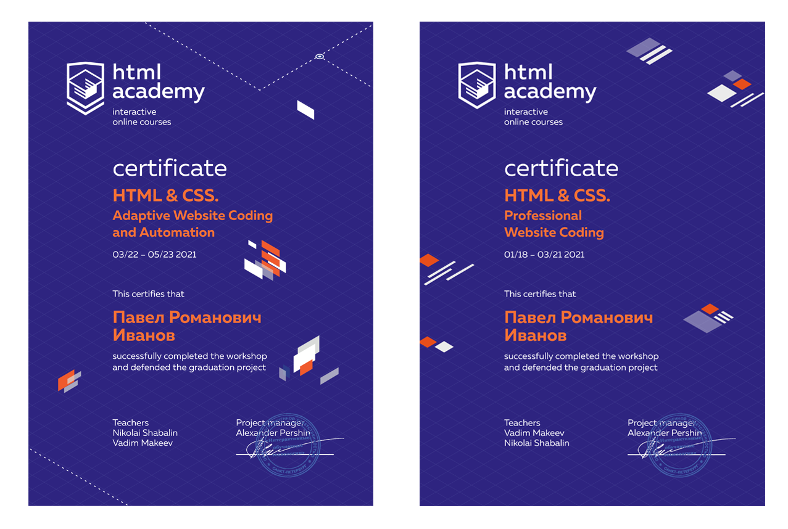

  

## 1. Требования: :orange_book:

- 1.1. Положите карточки в грид. :page_facing_up:

- 1.2. Грид-гэп — 20 пикселей. :page_facing_up:

- 1.3. Отступы между элементами в карточке должны быть как на макете. :page_facing_up:

- 1.4. Кнопки сделайте тегом button. :page_facing_up:

## 2. Рекомендации: :orange_book:

- 2.1. Шрифты можно подключить с Google Fonts. :page_facing_up:

- 2.2. Рядом с карточками даны фоны в большом разрешении. Используйте их. :page_facing_up:

- 2.3. Обратите особое внимание на нестандартные элементы карточек: бирка, ссылка, список, поле ввода и кнопки. :page_facing_up:

---

Click on the logo to open layout in Figma.

---

  
</>

  

|  Year  | Сertificate             |
| ------------- |:------------------:|
| 01.2021 - 03.2021    | HTML & CSS. Professional Website Coding    |
| 03.2021 - 05.2021     | HTML & CSS. Adaptive Website Coding and Automation |

---

  

  

  

  

  

[check-image]: https://github.com/htmlacademy-adaptive/1629453-pink-22/workflows/Project%20check/badge.svg?branch=master
[check-url]: https://github.com/htmlacademy-adaptive/1629453-pink-22/actions
[@htmlacademy]: https://htmlacademy.ru
[figma]: https://www.figma.com/file/ASeQqd0fG7Ug51ssFdapgv/HTML-1-%2F-%D0%A1%D0%B5%D0%B4%D0%BE%D0%BD%D0%B0-(30)?node-id=0%3A1
